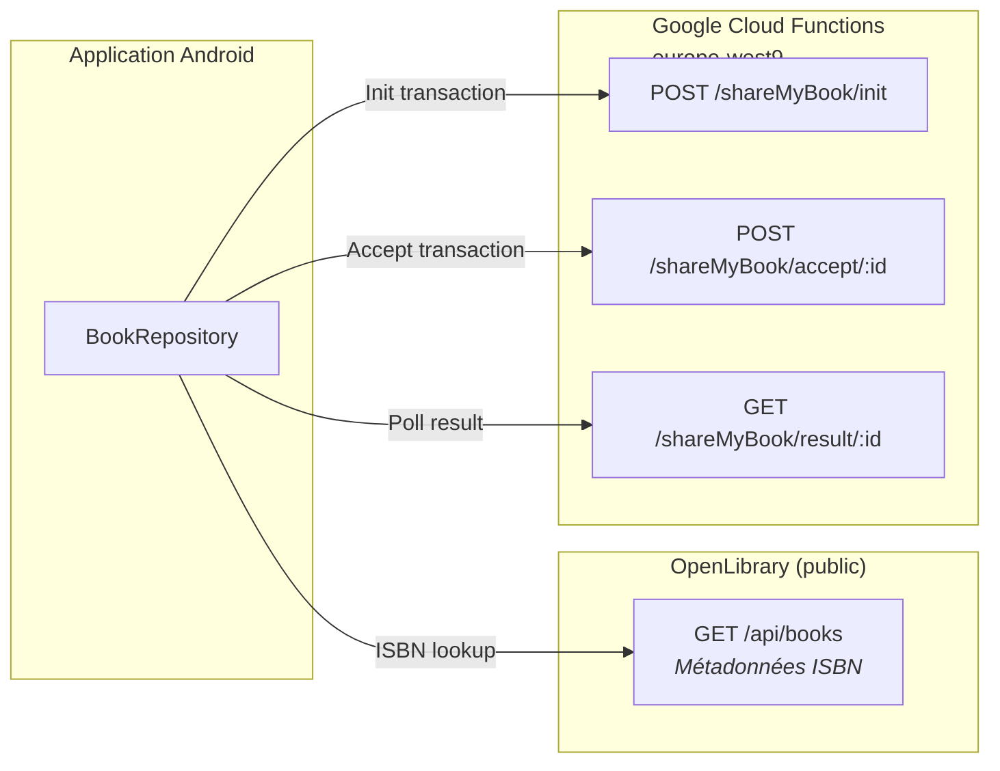
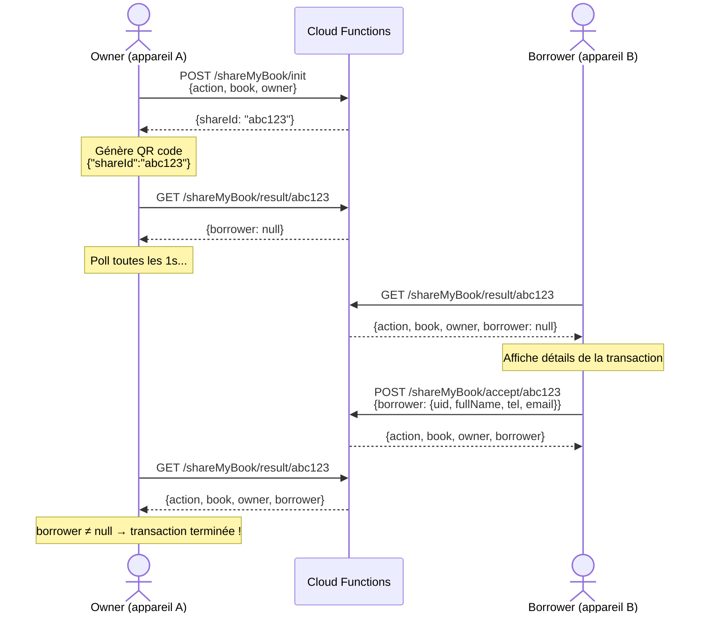

# API & Backend

## Vue d'ensemble des intégrations réseau

L'application communique avec deux services externes via Retrofit :



---

## Transaction API — Google Cloud Functions

**Base URL** : `https://europe-west9-mythic-cocoa-442917-i7.cloudfunctions.net/`  
**Région** : `europe-west9` (Paris)  
**Projet Firebase** : `sharemybook-30d42` (nom historique)

Le backend est stateless et fonctionne comme un **broker de transactions** : il stocke temporairement les données d'une transaction initiée par un owner et attend qu'un borrower l'accepte. Il ne persiste pas les bibliothèques.

### Cycle de vie d'une transaction



### `POST /shareMyBook/init`

Initie une transaction. Crée un `shareId` unique côté serveur et stocke les données.

**Request body** — `InitRequest` :

```json
{
  "action": "LOAN",
  "book": {
    "uid": "978-0321721349",
    "isbn": "978-0321721349",
    "title": "The Lord of the Rings",
    "authors": "J.R.R. Tolkien",
    "covers": "https://covers.openlibrary.org/b/id/8264423-L.jpg",
    "borrowerId": null,
    "lenderId": null
  },
  "owner": {
    "uid": "a1b2c3d4-...",
    "fullName": "Jean Dupont",
    "tel": "0612345678",
    "email": "jean@example.com"
  }
}
```

| Champ | Description |
|-------|-------------|
| `action` | `"LOAN"` (prêt) ou `"RETURN"` (retour) |
| `book` | Entité `Book` complète. Pour un RETURN, `borrowerId` est mis à `null` avant envoi |
| `owner` | Profil complet de l'initiateur |

**Response** — `InitResponse` :

```json
{ "shareId": "abc123def456" }
```

### `POST /shareMyBook/accept/{shareId}`

L'emprunteur (ou le retourneur) accepte la transaction. Le backend associe le `borrower` à la transaction existante.

**Path parameter** : `shareId` reçu via scan du QR code

**Request body** — `AcceptRequest` :

```json
{
  "borrower": {
    "uid": "e5f6g7h8-...",
    "fullName": "Marie Martin",
    "tel": "0698765432",
    "email": "marie@example.com"
  }
}
```

**Response** — `TransactionData` :

```json
{
  "action": "LOAN",
  "book": { "uid": "978-0321721349", "..." : "..." },
  "owner": { "uid": "a1b2c3d4-...", "..." : "..." },
  "borrower": { "uid": "e5f6g7h8-...", "..." : "..." }
}
```

### `GET /shareMyBook/result/{shareId}`

Endpoint de polling. Retourne l'état actuel de la transaction. Le champ `borrower` est `null` tant que personne n'a accepté.

**Response** — `TransactionData` (même structure que ci-dessus)

**Logique de détection côté client** (`TransactionViewModel.pollForResult`) :
- **LOAN** : la transaction est complète quand `result.borrower != null`
- **RETURN** : la transaction est complète quand `borrower` passe de `null` (état initial après init) à non-null (après accept)
- **Polling** : toutes les 1 seconde, max 120 tentatives (timeout 2 minutes)
- En cas d'erreur réseau sur un poll, le polling continue (catch silencieux)

### DTOs Kotlin

```kotlin
data class InitRequest(val action: String, val book: Book, val owner: User)
data class InitResponse(val shareId: String)
data class AcceptRequest(val borrower: User)
data class TransactionData(
    val action: String,
    val book: Book,
    val owner: User,
    val borrower: User?    // null tant que non acceptée
)
data class ShareIdQrCode(val shareId: String)  // payload encodé dans le QR
```

---

## OpenLibrary API

**Base URL** : `https://openlibrary.org/`  
API publique, sans authentification.

### `GET /api/books`

Récupère les métadonnées d'un livre par ISBN.

**Query parameters** :

| Paramètre | Valeur |
|-----------|--------|
| `bibkeys` | `ISBN:{isbn}` (ex: `ISBN:978-0321721349`) |
| `jscmd` | `data` |
| `format` | `json` |

**Response** — Map `String → BookDetails` :

```json
{
  "ISBN:978-0321721349": {
    "title": "The Lord of the Rings",
    "authors": [
      { "name": "J.R.R. Tolkien" }
    ],
    "cover": {
      "medium": "https://covers.openlibrary.org/b/id/8264423-M.jpg"
    }
  }
}
```

**Mapping vers l'entité `Book`** (dans `BookRepository.getBookDetailsFromApi`) :
- `uid` = ISBN (l'ISBN sert de clé primaire pour les livres ajoutés via scan)
- `title` = `bookDetails.title`
- `authors` = `bookDetails.authors?.joinToString { it.name }`
- `covers` = `bookDetails.cover?.medium`
- `borrowerId` = `null`
- `lenderId` = `null`

### DTOs Kotlin

```kotlin
data class BookDetails(
    val title: String,
    val authors: List<Author>?,
    val cover: Cover?
)
data class Author(val name: String)
data class Cover(val medium: String?)
```

---

## QR Code — Format et flux

### Payload

Le QR code contient un JSON sérialisé par Gson :

```json
{ "shareId": "abc123def456" }
```

Classe correspondante : `ShareIdQrCode(val shareId: String)`

### Génération (côté owner)

Dans `TransactionActivity`, après réception du `shareId` depuis le backend :

```kotlin
val json = Gson().toJson(ShareIdQrCode(shareId))
val bitmap: Bitmap = QRCode.from(json).withSize(1024, 1024).bitmap()
// Affiché dans un Image Compose à 256.dp
```

### Lecture (côté borrower)

Dans `ScannerActivity`, ML Kit détecte le QR et le contenu brut est parsé :

```kotlin
val shareIdQrCode = Gson().fromJson(qrContent, ShareIdQrCode::class.java)
if (shareIdQrCode?.shareId != null) {
    // → Ouvre AcceptTransactionActivity avec shareId en extra
}
```

Si le parsing échoue (pas un `ShareIdQrCode` valide), un toast "QR Code non reconnu" est affiché.

### Distinction EAN-13 vs QR dans le scanner

`BarcodeAnalyzer` est configuré pour détecter **les deux formats** :
- `Barcode.FORMAT_EAN_13` → retour du barcode à `MainActivity` via `setResult`
- `Barcode.FORMAT_QR_CODE` → parsing JSON et routage vers `AcceptTransactionActivity`

Le callback `onBarcodeScanned(value, isQrCode)` discrimine les deux cas.
