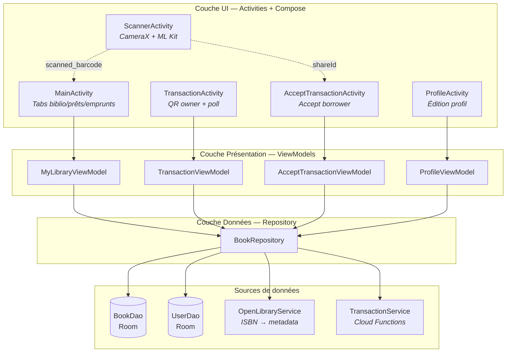
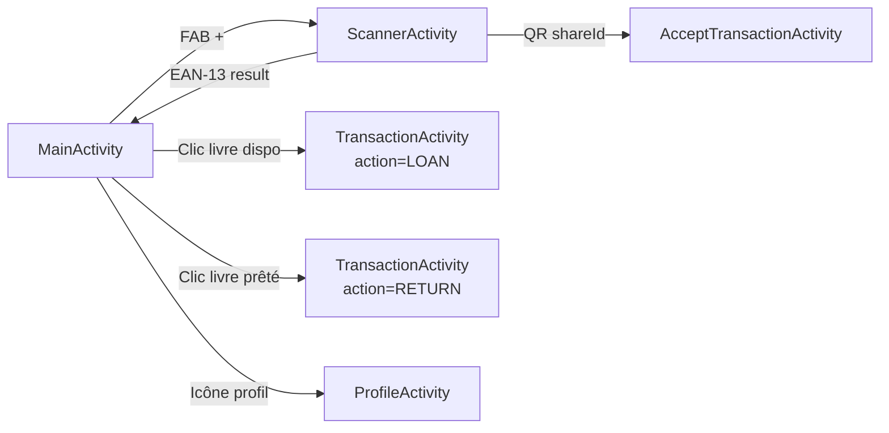

# Architecture

## Vue d'ensemble

L'application suit une architecture **MVVM single-module** avec séparation en 3 couches. La navigation est multi-Activity (chaque écran = une `ComponentActivity` avec `setContent` Compose), sans Navigation Component.

## Stack technique

| Couche | Techno | Rôle dans l'app |
|--------|--------|-----------------|
| UI | Jetpack Compose + Material 3 | Écrans déclaratifs, thème light/dark avec palette custom |
| Navigation | Multi-Activity + `StartActivityForResult` | `ScannerActivity` retourne le barcode, les transactions s'ouvrent par `Intent` avec extras |
| DI | Hilt | `@HiltAndroidApp` sur `MitosBookingApp`, `@HiltViewModel` sur tous les VM, `DataModule` pour le wiring |
| State management | `StateFlow` / `SharedFlow` | Chaque ViewModel expose des `StateFlow` observés via `collectAsState()` dans les Composables |
| Persistance locale | Room (SQLite) | DB `mitosbooking.db` v1, 2 tables (`books`, `users`), destructive migration fallback |
| Réseau | Retrofit 2 + Gson | 2 clients : OpenLibrary (metadata ISBN) et Cloud Functions (transactions) |
| Scan codes | CameraX + ML Kit Barcode | Formats EAN-13 (ISBN) et QR_CODE (transactions), analyse frame-by-frame |
| Génération QR | QRGen (JitPack) | Encode le `ShareIdQrCode` JSON en bitmap 1024×1024 affiché dans un `Image` Compose |
| Chargement images | Coil Compose | `rememberAsyncImagePainter` pour les couvertures OpenLibrary |
| Identité locale | `SharedPreferences` | `user_id` (UUID v4), généré au premier lancement, jamais modifié |

## Layering détaillé

### Navigation entre Activities

## Injection de dépendances — `DataModule`

Module Hilt unique (`@InstallIn(SingletonComponent)`) qui fournit :

| Provider | Scope | Description |
|----------|-------|-------------|
| `AppDatabase` | `@Singleton` | Room, `mitosbooking.db`, `fallbackToDestructiveMigration()` |
| `BookDao` | – | Extrait de `AppDatabase` |
| `UserDao` | – | Extrait de `AppDatabase` |
| `BookRepository` | `@Singleton` | Reçoit les 2 DAOs + les 2 services Retrofit |
| `Retrofit @Named("OpenLibrary")` | `@Singleton` | Base URL `https://openlibrary.org/`, Gson converter |
| `Retrofit @Named("Transaction")` | `@Singleton` | Base URL `https://europe-west9-mythic-cocoa-442917-i7.cloudfunctions.net/`, Gson converter |
| `OpenLibraryService` | `@Singleton` | Interface Retrofit créée depuis le Retrofit OpenLibrary |
| `TransactionService` | `@Singleton` | Interface Retrofit créée depuis le Retrofit Transaction |

## Choix de conception notables

### Multi-Activity vs Navigation Component

L'app utilise des `Intent` explicites entre Activities plutôt que le Navigation Component Compose. Ce choix simplifie la gestion du cycle de vie du scanner (CameraX) et des résultats de scan (`ActivityResultContracts`). Le `ScannerActivity` retourne son résultat via `setResult`, et les écrans de transaction passent `bookId`/`shareId`/`action` en extras.

### Synchronisation par polling

Les transactions sont asynchrones entre deux appareils. Plutôt qu'un WebSocket ou du push FCM, l'app utilise du **polling HTTP** :
- `TransactionViewModel` : poll `GET /result/{shareId}` toutes les **1 seconde**, max **120 tentatives** (2 min)
- Le poll détecte le changement d'état du champ `borrower` (null → non-null pour un LOAN, inverse pour un RETURN)

Ce choix est simple à implémenter mais consomme de la bande passante. Pour un usage en face-à-face (les deux utilisateurs sont côte à côte), c'est acceptable.

### Identité locale

Pas d'authentification Firebase/OAuth. L'identité repose sur un UUID v4 stocké en `SharedPreferences` (`user_prefs` → `user_id`), généré au premier lancement. Le profil (nom, téléphone, email) est saisi manuellement et persiste en Room. Ce UUID est envoyé au backend dans les transactions pour identifier les parties.

### Gestion de l'état de prêt

L'état de prêt n'est pas une table séparée mais directement encodé dans les colonnes `borrowerId` et `lenderId` de l'entité `Book` (cf. [DATA_MODEL.md](./DATA_MODEL.md) pour la sémantique détaillée). Cela simplifie les requêtes mais couple le modèle de données au modèle métier.

## Code legacy conservé

Deux flux de retour de livre coexistent dans le code :

| Flux | Fichiers | Statut |
|------|----------|--------|
| **Actuel** (shareId) | `TransactionActivity` + `AcceptTransactionActivity` | Utilisé |
| **Legacy** (QR direct) | `ConfirmReturnActivity` + `ReturnTransactionActivity` + `ReturnQrCode` + `ConfirmReturnViewModel` + `ReturnTransactionViewModel` | Non utilisé, conservé dans le codebase |

Le flux legacy utilisait un `ReturnQrCode(bookUid, lenderUid)` encodé directement dans le QR au lieu de passer par le backend. Il a été remplacé par le flux unifié shareId qui utilise les mêmes endpoints `init/accept/result` pour le prêt et le retour.

De même, `BooksRepository` (interface) existe mais n'est pas implémentée par la classe concrète `BookRepository` — c'est un reste de scaffold initial.
