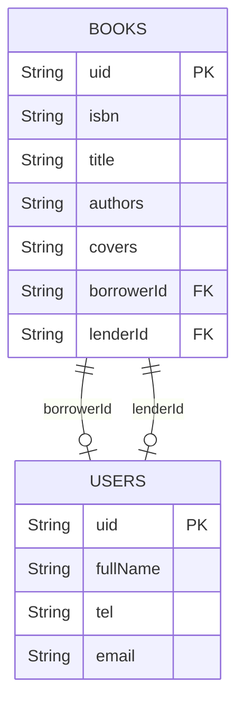

# Modèle de données

## Schéma

Base : `mitosbooking.db`, version 1, destructive migration. DAOs avec `Flow` et `OnConflictStrategy.REPLACE` pour l'insert.

## Sémantique des champs de prêt

La combinaison `borrowerId` / `lenderId` encode l'état du livre :

| `borrowerId` | `lenderId` | Signification | Onglet |
|---|---|---|---|
| `null` | `null` | Disponible (je le possède) | Ma bibliothèque |
| `<uid>` | `null` | Prêté à quelqu'un | Mes prêts |
| `<mon_uid>` | `<uid_owner>` | Emprunté (côté emprunteur) | Mes emprunts |

## Identité locale

`SharedPreferences` (`user_prefs`) stocke un `user_id` (UUID v4 généré au premier lancement). Ce même UUID est la PK du `User` local en Room, et sert d'identifiant dans les transactions backend.

La table `users` stocke aussi les utilisateurs distants rencontrés lors des transactions (pour afficher les noms dans les listes).

## Seed

26 livres de démo insérés au premier lancement si la table est vide (`MyLibraryViewModel.prepopulateDatabase`).
