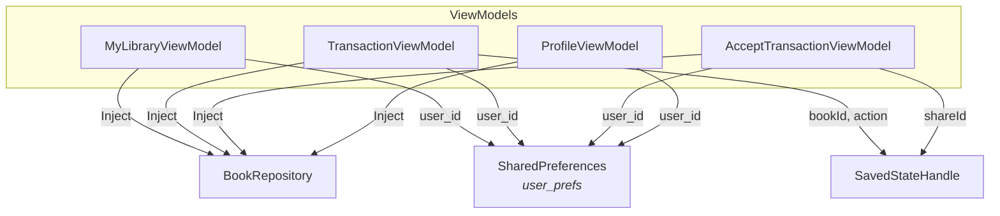

# Structure du projet

## Arborescence des sources

```
app/src/main/java/fr/enssat/sharemybook/mitosbooking/
│
├── MitosBookingApp.kt                  @HiltAndroidApp — entry point Hilt
│
├── MainActivity.kt                     Écran principal avec 3 onglets
│                                       Composables : MyLibraryScreen, MyLoansScreen,
│                                       MyBorrowsScreen, BookItem, BookValidationDialog
│
├── ScannerActivity.kt                  Scanner CameraX + ML Kit
│                                       Composables : CameraPreview
│                                       Classes : BarcodeAnalyzer (EAN-13 + QR)
│
├── ProfileActivity.kt                  Écran profil utilisateur
│                                       Composable : ProfileScreen (3 TextFields + save)
│
├── TransactionActivity.kt              Côté owner : init transaction + QR + poll
│                                       Composable : TransactionScreen
│
├── AcceptTransactionActivity.kt        Côté borrower : détails + bouton accept
│                                       Composable : AcceptTransactionScreen
│
├── ConfirmReturnActivity.kt            [LEGACY] Retour côté owner avec QR ReturnQrCode
├── ReturnTransactionActivity.kt        [LEGACY] Retour côté borrower (delete local)
│
├── data/
│   ├── DataModule.kt                   Module Hilt @InstallIn(SingletonComponent)
│   │                                   Fournit : AppDatabase, DAOs, Repository,
│   │                                   2 Retrofit (@Named), SharedPreferences
│   │
│   ├── dao/
│   │   ├── BookDao.kt                  @Dao — CRUD books, retour Flow
│   │   └── UserDao.kt                  @Dao — CRUD users, retour Flow
│   │
│   ├── database/
│   │   └── AppDatabase.kt             @Database(entities=[Book, User], version=1)
│   │                                   exportSchema = false
│   │
│   ├── entity/
│   │   ├── Book.kt                     @Entity("books") — 7 champs dont borrowerId/lenderId
│   │   └── User.kt                     @Entity("users") — uid, fullName, tel, email
│   │
│   ├── remote/
│   │   ├── OpenLibraryModels.kt        DTOs : BookDetails, Author, Cover
│   │   ├── OpenLibraryService.kt       Interface Retrofit : GET /api/books
│   │   ├── TransactionModels.kt        DTOs : InitRequest, InitResponse, AcceptRequest,
│   │   │                               TransactionData, ShareIdQrCode
│   │   ├── TransactionService.kt       Interface Retrofit : init, accept, result
│   │   └── ReturnQrCode.kt            [LEGACY] DTO QR retour (bookUid + lenderUid)
│   │
│   └── repository/
│       ├── BookRepository.kt           Classe concrète — combine DAOs + 2 services Retrofit
│       │                               Méthodes : CRUD books/users, getBookDetailsFromApi,
│       │                               initTransaction, acceptTransaction, resultTransaction
│       └── BooksRepository.kt          [NON UTILISÉ] Interface repository (scaffold)
│
└── ui/
    ├── components/
    │   └── ModernComponents.kt         Composables réutilisables :
    │                                   ModernTabRow, ElevatedBookCard,
    │                                   GradientHeader, StatisticCard
    │
    ├── screens/                         (vide — les screens sont inline dans les Activities)
    │
    ├── theme/
    │   ├── Color.kt                    Palette complète light/dark + couleurs sémantiques
    │   │                               StatusAvailable (vert), StatusLoaned (orange),
    │   │                               StatusBorrowed (bleu), StatusUnavailable (gris)
    │   ├── Shape.kt                    Shapes Material 3 (4dp → 28dp)
    │   ├── Theme.kt                    MitosBookingTheme — light/dark/dynamic color
    │   │                               StatusBar color = primary, dynamic color désactivé
    │   ├── ThemeManager.kt             Singleton toggle light/dark via SharedPreferences
    │   └── Type.kt                     Typography Material 3 (bodyLarge customisé)
    │
    └── viewmodel/
        ├── MyLibraryViewModel.kt       Gestion des 3 onglets, scan ISBN, ajout livre
        │                               Génère user_id, prepopulate seed, filtrage Flow
        ├── TransactionViewModel.kt     Init + poll côté owner (LOAN et RETURN)
        │                               SavedStateHandle : bookId, action
        │                               Poll : 1s intervalle, max 120 tentatives
        ├── AcceptTransactionViewModel.kt  Load + accept côté borrower
        │                               SavedStateHandle : shareId
        │                               Insert/delete book local selon action
        ├── ProfileViewModel.kt         Load/save profil via Room + SharedPreferences
        ├── ExploreViewModel.kt         [PLACEHOLDER] Vide, prévu pour future feature
        ├── ConfirmReturnViewModel.kt   [LEGACY] Poll local pour retour (2s, max 60)
        └── ReturnTransactionViewModel.kt [LEGACY] Delete book local sur confirm
```

## Graphe de dépendances des ViewModels



## Fichiers de configuration

| Fichier | Rôle |
|---------|------|
| `build.gradle.kts` (root) | Plugins AGP 8.13.0, Kotlin 1.9, Hilt 2.48, KSP 1.9.0-1.0.13 |
| `app/build.gradle.kts` | Dépendances applicatives, compileSdk 36, namespace `fr.enssat.sharemybook.mitosbooking` |
| `app/google-services.json` | Config Firebase (projet `sharemybook-30d42`, package `fr.enssat.sharemybook.mitosbooking`) |
| `gradle/libs.versions.toml` | Version catalog — partiellement utilisé (les dépendances sont hardcodées dans app/build.gradle.kts) |
| `settings.gradle.kts` | Repositories (google, mavenCentral, JitPack pour QRGen) |
| `app/src/main/AndroidManifest.xml` | 7 Activities déclarées, permissions INTERNET + CAMERA |

## Dépendances tierces

| Librairie | Version | Usage |
|-----------|---------|-------|
| Jetpack Compose BOM | 2024.02.01 | UI déclarative (ui, material3, icons-extended) |
| Hilt | 2.51.1 | Injection de dépendances |
| Room | 2.6.1 | Persistance SQLite (runtime + ktx + compiler KSP) |
| CameraX | 1.3.1 | Capture caméra (core, camera2, lifecycle, view) |
| ML Kit Barcode | 17.2.0 | Détection codes-barres et QR |
| Retrofit | 2.9.0 | Client HTTP (+ converter-gson) |
| Coil Compose | 2.5.0 | Chargement d'images asynchrone |
| QRGen Android | 3.0.1 | Génération de QR codes en bitmap (via JitPack) |
| Navigation Compose | 2.7.6 | Importée mais non utilisée pour la navigation (multi-Activity) |

## Fichiers legacy

Les fichiers suivants sont présents dans le codebase mais **ne sont plus utilisés** dans le flux principal. Ils correspondent à une première implémentation du retour de livre qui passait par un QR code local (sans backend) :

| Fichier | Raison du legacy |
|---------|------------------|
| `ConfirmReturnActivity.kt` | Remplacé par `TransactionActivity` avec `action=RETURN` |
| `ReturnTransactionActivity.kt` | Remplacé par `AcceptTransactionActivity` avec `action=RETURN` |
| `ConfirmReturnViewModel.kt` | Polling local au lieu du backend |
| `ReturnTransactionViewModel.kt` | Delete local sans passer par le backend |
| `ReturnQrCode.kt` | Payload `{bookUid, lenderUid}` remplacé par `ShareIdQrCode` |
| `BooksRepository.kt` | Interface non implémentée par `BookRepository` |
| `ExploreViewModel.kt` | ViewModel vide, feature non implémentée |
