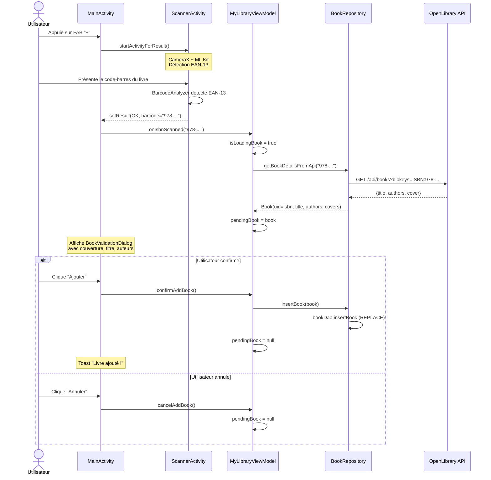
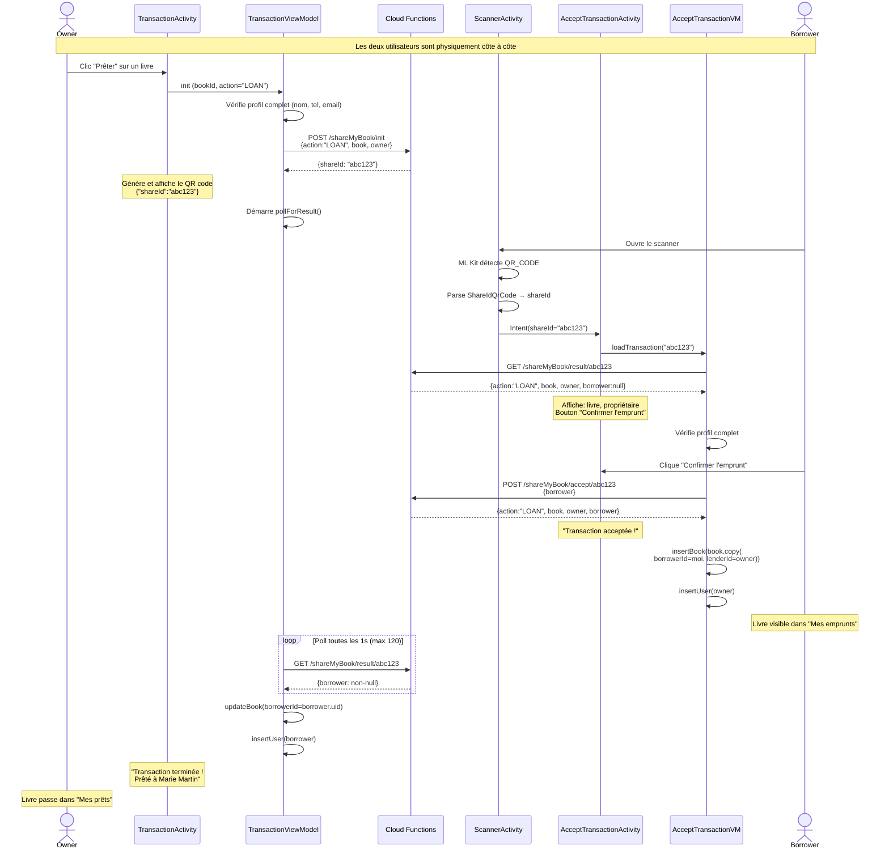
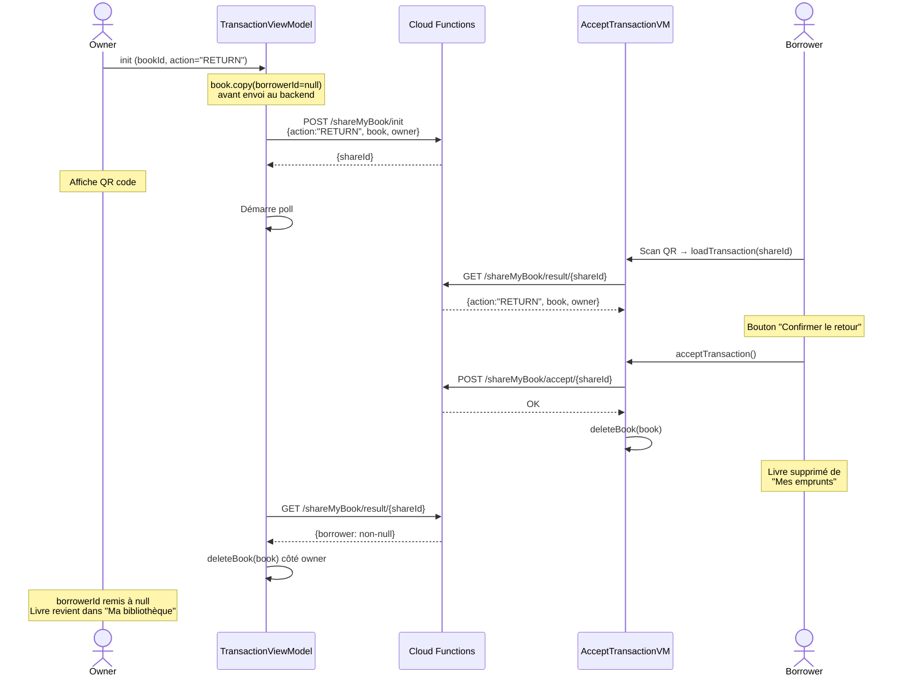
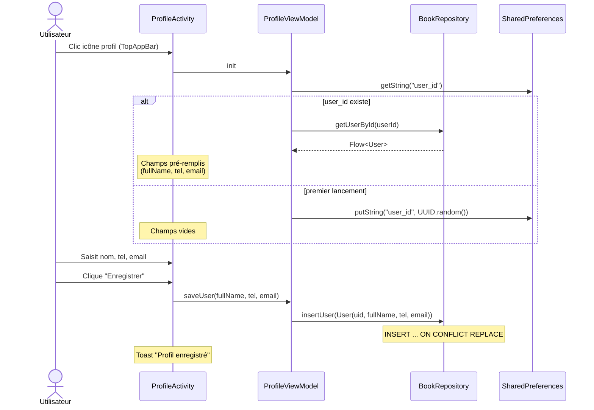
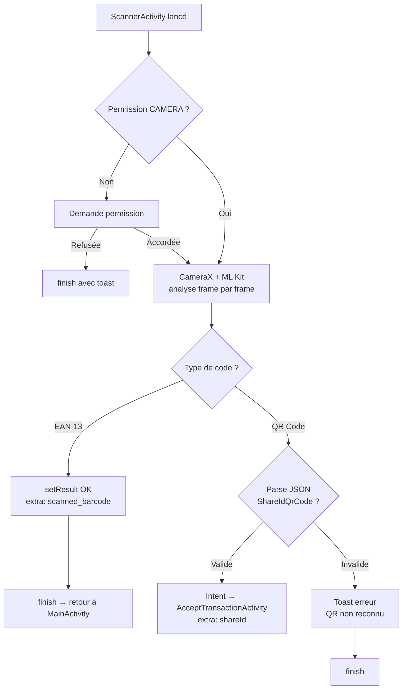

# Flux utilisateur

## 1. Ajout d'un livre à sa bibliothèque

L'utilisateur scanne le code-barres ISBN d'un livre physique. L'app récupère les métadonnées via OpenLibrary, affiche un dialogue de confirmation, puis insère le livre en base locale.

**Points d'attention** :
- Si l'ISBN n'est pas trouvé sur OpenLibrary, un toast d'erreur est affiché
- L'ISBN est utilisé comme `uid` (clé primaire) — scanner deux fois le même livre fait un REPLACE
- Le `BookValidationDialog` affiche un `CircularProgressIndicator` pendant le chargement API

---

## 2. Prêt d'un livre (LOAN)

Le propriétaire initie un prêt depuis l'onglet "Ma bibliothèque" en cliquant "Prêter" sur un livre disponible. L'app crée une transaction côté backend, affiche un QR code, et attend que l'emprunteur le scanne.

**Effets sur les bases locales** :

| Appareil | Action Room | Résultat |
|----------|-------------|----------|
| Owner | `updateBook(borrowerId = borrower.uid)` | Le livre passe dans l'onglet "Mes prêts" |
| Owner | `insertUser(borrower)` | Stocke le profil de l'emprunteur pour affichage |
| Borrower | `insertBook(book, borrowerId=self, lenderId=owner)` | Le livre apparaît dans "Mes emprunts" |
| Borrower | `insertUser(owner)` | Stocke le profil du propriétaire |

---

## 3. Retour d'un livre (RETURN)

Le propriétaire initie le retour depuis l'onglet "Mes prêts" en cliquant "Générer le QR code". Le flux est identique au prêt mais avec `action="RETURN"`.

**Différences avec le LOAN** :
- Le `book` envoyé au backend a son `borrowerId` mis à `null` avant envoi
- Côté borrower : `deleteBook` au lieu de `insertBook`
- Côté owner : le livre retrouve `borrowerId = null` et repasse dans l'onglet "Ma bibliothèque"

---

## 4. Profil utilisateur

**Validation du profil** : les `TransactionViewModel` et `AcceptTransactionViewModel` vérifient que `fullName`, `tel` et `email` sont non vides avant d'autoriser une transaction. Si le profil est incomplet, un message d'erreur est affiché et l'opération est bloquée.

---

## 5. Scanner — Double usage

Le `ScannerActivity` sert à deux flux distincts selon le type de code détecté :

**Détails techniques** :
- `BarcodeAnalyzer` est un `ImageAnalysis.Analyzer` avec un flag `@Volatile isScanning` pour éviter les détections multiples
- Les formats acceptés : `Barcode.FORMAT_QR_CODE` et `Barcode.FORMAT_EAN_13`
- Le scanner s'arrête dès la première détection réussie (`isScanning = false`)

---

## 6. Données de démo (seed)

Au premier lancement, si la table `books` est vide, `MyLibraryViewModel` insère automatiquement 26 livres de démonstration avec des URLs de couverture OpenLibrary valides. Cela permet de tester l'app immédiatement sans scanner de livres physiques.

Catégories du seed : Fantasy (5), Science-Fiction (5), Classiques (5), Romans modernes (5), Thrillers (3), Non-fiction (3).
